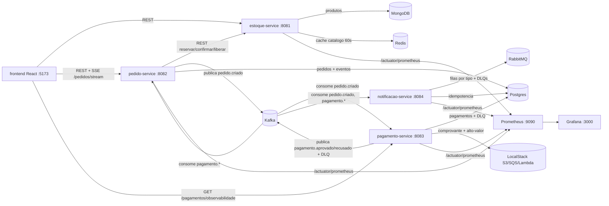

# Pedidos Plataforma — E-commerce orientado a eventos (Java + React)

[](https://github.com/andrelima28439/pedidos-plataforma/actions/workflows/ci.yml)
[](LICENSE)

Plataforma de pedidos e pagamentos resilientes em Java: Spring Boot, microsserviços orientados a eventos (Kafka + RabbitMQ), idempotência, retry com backoff e DLQ, MongoDB, Redis, PostgreSQL, AWS via LocalStack (S3/SQS/Lambda), frontend React com tempo real (SSE), observabilidade (Actuator/Prometheus/Grafana) e CI no GitHub Actions — tudo com testes automatizados.

Decisões técnicas (ADRs) em `docs/decisoes-tecnicas.md`. Arquitetura detalhada em `docs/arquitetura.md`.

## Arquitetura



**Fluxo:** cliente cria pedido → estoque reservado (quantidade bloqueada) → evento `pedido.criado` no Kafka → pagamento aprovado/recusado → pedido atualizado + estoque confirmado/liberado → notificação enfileirada → frontend atualizado via SSE sem refresh. Detalhes em `docs/arquitetura.md`.

## Pré-requisitos

- Docker + Docker Compose
- JDK 21 e Maven 3.9+
- Node 20+ (para o frontend)

## Como rodar do zero

```bash
# 1. Subir a infraestrutura (Postgres, Mongo, Redis, Kafka, RabbitMQ, Console, LocalStack, Prometheus, Grafana)
docker compose up -d

# 2. Aguardar tudo healthy
docker compose ps

# 3. Subir os serviços (um terminal cada)
mvn -pl estoque-service spring-boot:run      # 8081
mvn -pl pedido-service spring-boot:run       # 8082
mvn -pl pagamento-service spring-boot:run    # 8083
mvn -pl notificacao-service spring-boot:run  # 8084
# (ou rode os jars com java -jar */target/*.jar após mvn -DskipTests package)

# 4. Subir o frontend
cd frontend && cp .env.example .env && npm install && npm run dev  # http://localhost:5173
```

UIs úteis: Console Kafka http://localhost:8080 · RabbitMQ http://localhost:15672 (guest/guest) · Prometheus http://localhost:9090 · Grafana http://localhost:3000 (admin/admin).

## Demonstração do fluxo (curl)

```bash
# token (clienteId livre, ex: demo)
TOKEN=$(curl -s -X POST http://localhost:8082/auth/token \
  -H 'Content-Type: application/json' -d '{"clienteId":"demo"}' | python3 -c "import json,sys; print(json.load(sys.stdin)['token'])")

# um produto do catálogo (semeado automaticamente)
PROD=$(curl -s http://localhost:8081/produtos | python3 -c "import json,sys; d=json.load(sys.stdin); print(d[0]['id'])")

# caminho feliz: 100.00 → PAGO em segundos
PED=$(curl -s -X POST http://localhost:8082/pedidos -H "Authorization: Bearer $TOKEN" \
  -H 'Content-Type: application/json' -d "{\"itens\":[{\"produtoId\":\"$PROD\",\"quantidade\":1,\"precoUnitario\":100.00}]}" \
  | python3 -c "import json,sys; print(json.load(sys.stdin)['id'])")
curl -s -H "Authorization: Bearer $TOKEN" http://localhost:8082/pedidos/$PED | python3 -c "import json,sys; print(json.load(sys.stdin)['status'])"

# pagamento recusado: valor terminado em .99 → RECUSADO + estoque liberado
curl -s -X POST http://localhost:8082/pedidos -H "Authorization: Bearer $TOKEN" \
  -H 'Content-Type: application/json' -d "{\"itens\":[{\"produtoId\":\"$PROD\",\"quantidade\":1,\"precoUnitario\":199.99}]}"

# DLQ: forçar 3 falhas no gateway (DEV-ONLY), criar pedido, consultar e reprocessar
curl -s -X POST "http://localhost:8083/pagamentos/admin/gateway/falhar-proximas?n=3"
curl -s http://localhost:8083/pagamentos/dlq
EVT=$(curl -s http://localhost:8083/pagamentos/dlq | python3 -c "import json,sys; print(json.load(sys.stdin)[0]['eventId'])")
curl -s -X POST http://localhost:8083/pagamentos/dlq/$EVT/reprocessar

# observabilidade (mesma fonte do painel do frontend)
curl -s http://localhost:8083/pagamentos/observabilidade
```

Regras de negócio: valores terminados em `.99` são recusados (mock do gateway); pedidos de valor **>= 1000.00** vão para a fila SQS `pedidos-alto-valor` (revisão manual/antifraude).

## Demonstração via Postman

Importe `postman/pedidos-plataforma.postman_collection.json` (suba estoque 8081,
pedido 8082 e pagamento 8083 antes). Ordem: `0. Obter token` → `1. Listar produtos` →
`2. Caminho feliz` (100.00 → PAGO) → `3. Pagamento recusado` (199.99) →
`3b. Verificar recusa liberou estoque` (assert automático: `RECUSADO` e `quantidadeReservada == 0`) →
`4. Consultar DLQ` → `A1. Forçar falhas (DEV)` → novo pedido → `4` → `5. Reprocessar` (→ APROVADO).

## Frontend React

```bash
cd frontend
cp .env.example .env   # VITE_ESTOQUE_URL/PEDIDO_URL/PAGAMENTO_URL (defaults localhost)
npm install
npm run dev    # http://localhost:5173
npm run build  # compilação de produção (dist/)
```

Telas: Catálogo (paginação de 6), Criar pedido (carrinho), Meus pedidos (SSE),
Observabilidade (DLQ + retry 24h via `GET /pagamentos/observabilidade`).
Toda chamada tem loading/erro (não só o caminho feliz).

## AWS via LocalStack

Tudo roda local contra `http://localhost:4566` (ver `docker-compose.yml`).

- **S3**: pagamento APROVADO gera `s3://comprovantes-pagamentos/comprovantes/{eventId}.json`.
- **SQS**: pedido com valor **>= 1000.00** vai para a fila `pedidos-alto-valor`
  para revisão manual (antifraude). Abaixo disso, nada é enviado.
- **Lambda**: `lambda/resumo_diario.py` (`resumo-diario-pedidos`) — resumo
  `{totalPedidos, valorTotal, ticketMedio}`; aceita payload direto ou
  _records_ SQS; com event source mapping SQS→Lambda. Demonstração: `python lambda/prova_lambda.py`
  (requer `boto3` e LocalStack em `localhost:4566`).

## Testes

```bash
mvn -B verify   # backend: 31 testes + JaCoCo
cd frontend && npm test   # frontend: 3 testes (vitest)
```

31 testes de backend (integração contra Postgres/Mongo/Redis/Kafka/RabbitMQ/LocalStack reais do compose):

- **estoque-service (5)**: `ProdutoFluxoTest` (4 — CRUD, reservar/liberar/confirmar, cache) + `ReservaConcorrenteTest` (1 — duas reservas simultâneas não vendem além do estoque, sem oversell).
- **pedido-service (9)**: `PedidoFluxoTest` (2 — criar → AGUARDANDO → PAGO/RECUSADO com histórico) + `PagamentoIdempotenciaTest` (1 — mesmo `eventId` 2x sem efeito duplicado) + `TransicaoStatusTest` (2 — máquina de estados, ex: `CANCELADO` nunca vira `PAGO`) + `PedidoSecurityTest` (1 — cliente só acessa os próprios pedidos) + `SseQueryTokenTest` (1 — `GET /pedidos?token=...` → 200 sem header) + `ObservabilidadeTest` (2).
- **pagamento-service (7)**: `RetrySucessoTest` (2 — 2 falhas transitórias + sucesso na 3ª com backoff 50ms/100ms) + `DlqReprocessarTest` (1 — 3 falhas → DLQ → reprocessar → APROVADO) + `AwsIntegracaoTest` (2 — comprovante listado no S3; 1500.00 na fila SQS e 100.00 fora dela) + `ObservabilidadeTest` (2).
- **notificacao-service (10)**: `IdempotenciaTest` (1 — mesma mensagem 2x, 1 envio) + `RabbitDlqTest` (1 — reject sem requeue chega à DLQ do RabbitMQ) + `RoteamentoEventosTest` (3 — cada tipo de evento Kafka cai na fila RabbitMQ correspondente) + `EnvioServiceTest` (2 — payload normal aceito nos 3 listeners, payload `FAIL` rejeitado sem requeue) + `DlqObservabilidadeTest` (3 — lista processadas, tamanhos das 3 DLQs, consumers de DLQ logam sem quebrar).

Cobertura (JaCoCo, gerado no `verify`): `*/target/site/jacoco/index.html` por módulo
(estoque ~67%, pedido ~77%, pagamento ~80%, notificacao ~96% de linhas).

## Observabilidade

- Prometheus `http://localhost:9090` (scrape `host.docker.internal:8081-8084/actuator/prometheus`;
  targets ficam `down` até os 4 serviços subirem via `mvn spring-boot:run` ou `java -jar` — esperado).
- Grafana `http://localhost:3000` (admin/admin), dashboard **Pedidos Plataforma**
  provisionado de `grafana/dashboards/pedidos-dashboard.json` (JSON no repo, sem clique manual):
  pedidos por status, `rate(pagamento_retry_total[5m])`, DLQ ao longo do tempo.
- Métricas custom têm **fonte única no Postgres** (gauges com supplier nas mesmas queries
  do `GET /pagamentos/observabilidade` que o frontend consome) — os números batem por construção.
- Logs JSON (LogstashEncoder, campo `service` + MDC `correlationId` = pedidoId de ponta a ponta);
  `X-Correlation-Id` propagado no HTTP e nos eventos Kafka, permitindo rastrear
  um pedido do início ao fim pelos logs dos serviços.

## Estrutura

```
pedidos-plataforma/
├── docker-compose.yml             (infra: Postgres, Mongo, Redis, Kafka, RabbitMQ, Console, LocalStack, Prometheus, Grafana)
├── pom.xml                        (pai multi-módulo)
├── pedido-service/                (8082: pedidos, JWT, SSE, consumers pagamento.*)
├── estoque-service/               (8081: catálogo Mongo + reserva + cache Redis)
├── pagamento-service/             (8083: mock gateway, retry/DLQ, S3/SQS, observabilidade)
├── notificacao-service/           (8084: Kafka → RabbitMQ + DLQs)
├── frontend/                      (React + Vite: catálogo, carrinho, pedidos SSE, observabilidade)
├── lambda/                        (resumo_diario.py + prova_lambda.py)
├── postman/                       (collection)
├── docs/arquitetura.md docs/decisoes-tecnicas.md
├── grafana/ prometheus/           (dashboard e scrape provisionados)
└── .github/workflows/ci.yml
```

## Limitações conhecidas e o que muda em AWS real

- **Credenciais**: local usa `test/test`; em AWS real usar IAM roles
  (EKS/IRSA, Lambda execution role) — nunca access key no código; `aws.endpoint`
  vazio para usar endpoints reais.
- **IAM**: LocalStack aceita role dummy
  (`arn:aws:iam::000000000000:role/lambda-test`); em prod criar roles mínimas
  (s3:PutObject/GetObject no bucket, sqs:SendMessage/ReceiveMessage na fila,
  logs:CreateLogGroup/Stream).
- **S3**: bucket criado via `CreateBucket` local; em prod via Terraform/CloudFormation
  com versionamento, SSE-S3/KMS, lifecycle e Block Public Access.
- **SQS**: fila padrão local; em prod usar DLQ própria da fila + `visibility-timeout`
  e `maxReceiveCount` adequados, além de alarme CloudWatch.
- **Lambda**: deploy local via ZipFile + `create_event_source_mapping`; em prod via
  SAM/Terraform, com VPC (se acessar RDS), reserved concurrency e
  EventBridge Scheduler para o resumo diário.
- **Demais simplificações do projeto**: JWT próprio sem Keycloak, gateway de
  pagamento mockado (regra `.99`), sem circuit breaker entre REST síncronos.
- **Token JWT via query string no SSE** (`GET /pedidos/stream?token=`): solução para o
  limite do `EventSource` (não envia headers `Authorization`), mas token na URL pode vazar
  em logs de acesso/proxy. Mitigações futuras: cookie `HttpOnly`/`Secure` para o stream,
  expiração curta do token ou ticket de uso único para a conexão SSE.
- **CI verde no GitHub Actions**: todas as etapas do workflow (spotless, testes, build do frontend, build das imagens Docker) passam a cada push.

## CI

`.github/workflows/ci.yml` (push/PR, jobs `backend`/`frontend`/`docker`): infra via `docker compose up` →
`mvn -B spotless:check` → `mvn -B verify` (31 testes + JaCoCo) → `npm ci/lint/test/build` →
`docker build` das 4 imagens.

## Licença

Distribuído sob a licença MIT. Veja o arquivo `LICENSE`.
