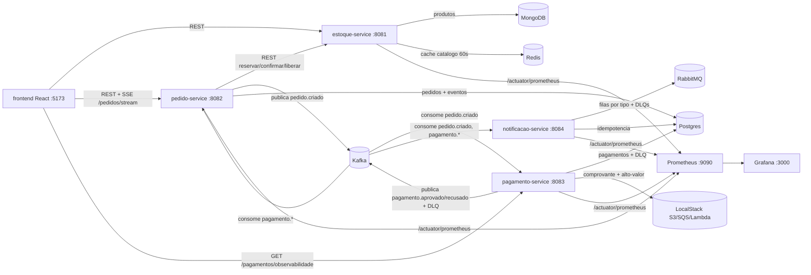

# Arquitetura — Plataforma de Pedidos e Pagamentos

## Diagrama

## Componentes

| Componente | Papel | Porta | Estado |
|---|---|---|---|
| `estoque-service` | Catálogo (MongoDB) + reserva com lock otimista + cache Redis 60s | 8081 | Postgres-free (Mongo/Redis) |
| `pedido-service` | Agregado Pedido (DDD, transições explícitas), JWT, SSE, consumers idempotentes | 8082 | Postgres + Kafka |
| `pagamento-service` | Mock gateway (regra `.99`), retry backoff, DLQ Kafka + reprocesso, S3/SQS | 8083 | Postgres + Kafka + LocalStack |
| `notificacao-service` | Kafka → RabbitMQ (1 fila por tipo + DLQs), envio simulado, idempotente | 8084 | Postgres + Kafka + RabbitMQ |
| `frontend` | Catálogo, carrinho, meus pedidos (SSE), observabilidade | 5173 | REST nos serviços |
| Kafka (KRaft) | Eventos de domínio: `pedido.criado`, `pagamento.aprovado/recusado`, `pagamento.dlq` | 9092/29092 | — |
| RabbitMQ | Notificações ponto-a-ponto + DLX/DLQs | 5672/15672 | — |
| PostgreSQL | Pedidos, pagamentos, DLQs, idempotência (transacional) | 5432 | — |
| MongoDB | Produtos (schema flexível) | 27017 | — |
| Redis | Cache de catálogo | 6379 | — |
| LocalStack | S3 comprovantes, SQS alto-valor, Lambda resumo | 4566 | — |
| Prometheus/Grafana | Scrape `/actuator/prometheus`, dashboard provisionado | 9090/3000 | — |

## Fluxo ponta a ponta

1. Cliente obtém JWT via `POST /auth/token` (`pedido-service`, corpo `{clienteId}`).
2. `POST /pedidos` (pedido-service): valida itens, reserva cada um no `estoque-service`
   via REST (`POST /produtos/{id}/reservar` — quantidade fica bloqueada, não decrementada)
   e salva o pedido `AGUARDANDO_PAGAMENTO` com histórico.
3. pedido-service publica `pedido.criado` (Kafka, correlation-id = pedidoId).
4. pagamento-service consome o evento e processa no mock de gateway:
   valor terminado em `.99` → `RECUSADO`; demais → `APROVADO` (comprovante no S3;
   se valor ≥ 1000, mensagem no SQS `pedidos-alto-valor`). Publica
   `pagamento.aprovado` ou `pagamento.recusado`. Falha transitória: retry com backoff
   (50ms, 100ms, até 3 tentativas); falha definitiva: `pagamento.dlq` + reprocesso manual.
5. pedido-service consome o resultado: `PAGO` (+ `confirmar` no estoque, decrementa de fato)
   ou `RECUSADO` (+ `liberar` no estoque, volta ao livre).
6. notificacao-service consome os eventos, enfileira no RabbitMQ (1 fila por tipo) e
   "envia" (log). Falha de envio: reject sem requeue → DLQ própria da fila.
7. Frontend recebe as transições via SSE (`GET /pedidos/stream?token=...`) sem refresh.

## Rastreabilidade

Envie `X-Correlation-Id` (ou receba um gerado de volta no response). O pedido-service usa o
pedidoId como correlation-id: ele viaja nos headers HTTP, no MDC dos logs JSON (`service` +
`correlationId` via LogstashEncoder) e dentro dos eventos Kafka, aparecendo nos logs dos
4 serviços para rastrear um pedido do início ao fim.

## Topologia de mensageria

- **Kafka** (streaming, replay): `pedido.criado` → pagamento; `pagamento.aprovado/recusado`
  → pedido + notificação; `pagamento.dlq` → investigação manual via endpoint.
  Serialização JSON **sem** type headers + `default.type` por listener (ADR-014).
- **RabbitMQ** (filas de trabalho): exchange `notificacao.exchange` → 1 fila por tipo,
  cada uma com `x-dead-letter-exchange=notificacao.dlx` → DLQ própria (ADR-011).

## Resiliência (onde cada mecanismo mora)

- **Idempotência:** `eventos_processados(eventId)` no pedido, `pagamentos(eventId único)` +
  `pagamento_dlq`, `notificacoes_processadas` — 2ª entrega ignorada (testes em todos).
- **Concorrência:** `@Version` no `Produto` — 2 reservas simultâneas não vendem além do estoque.
- **Retry/DLQ Kafka:** backoff 50ms×2ⁿ no pagamento → `pagamento.dlq` + reprocesso manual.
- **DLQ RabbitMQ:** reject sem requeue → `notificacao.*.dlq` + log para ação manual.
- **Correlação:** `correlationId = pedidoId` no MDC/logs JSON, header HTTP e eventos Kafka.

## Decisões (resumo — detalhe em `decisoes-tecnicas.md`)

ADR-001 Kafka+RabbitMQ · ADR-002 Mongo vs Postgres · ADR-003 Redis 60s ·
ADR-004 lock otimista · ADR-005 Maven/Java 21 · ADR-006 JWT próprio ·
ADR-007 reserva REST síncrona · ADR-008 SSE · ADR-009/011 idempotência ·
ADR-010 retry/DLQ · ADR-012 AWS LocalStack · ADR-013 frontend ·
ADR-014 observabilidade · ADR-015 CI sem Testcontainers.
